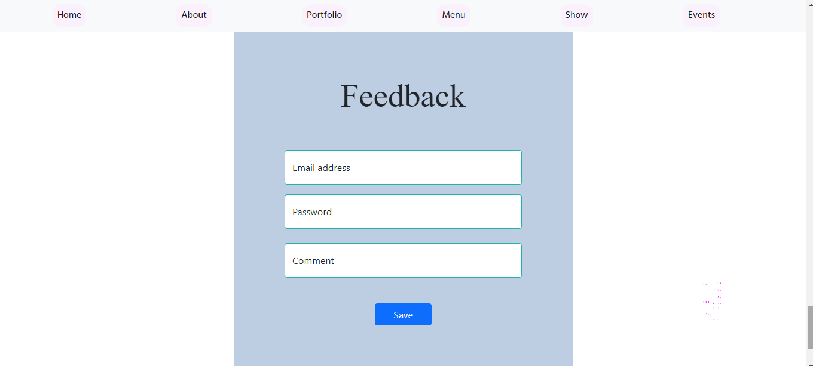

# UI Responsive Site

<b>The project contain registeration page</b>

<b>when you regitser it leads you to home page that displays content of the site with the navbar fixed</b>

- <b>you can see the details for each post in a separite page</b>
    - post content
    - post likes counter 
    - post comments
    - if you are user you can like or comment on post

- <b>then to the about section</b>

- <b>you can see a mini portfolio</b>

- <b>then the menu of the restaurant</b>
    

- <b> a slider</b>
    

- <b> Events of the restaurant</b>
    

- <b> you can fill a feedback form with you opinions about the restaurant</b>
    

- <b>footer that contain the restaurant logo and copyrights</b>
    

- <b>finally your welcome to be one of our restaurant website</b>
    

